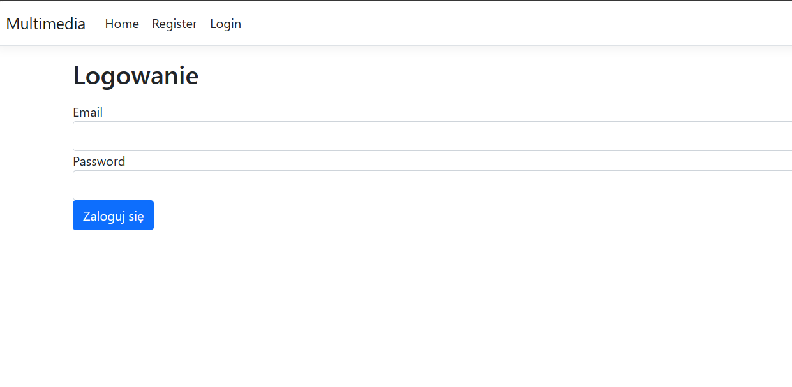
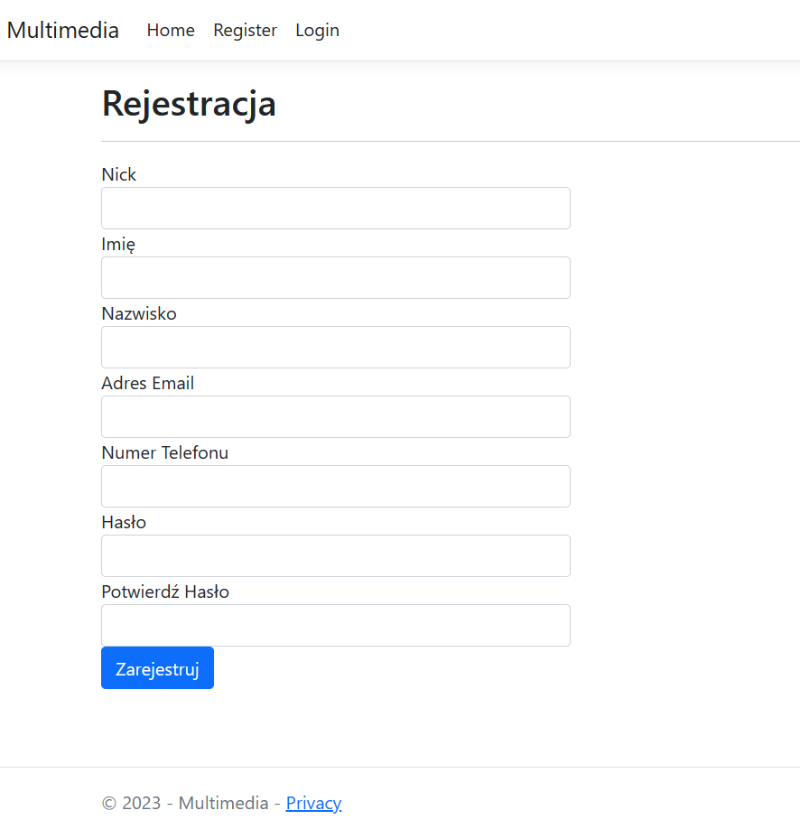
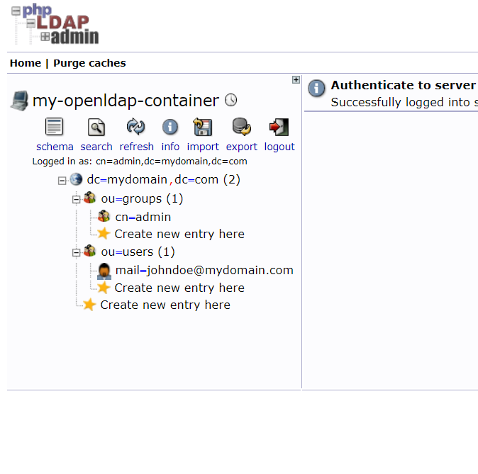
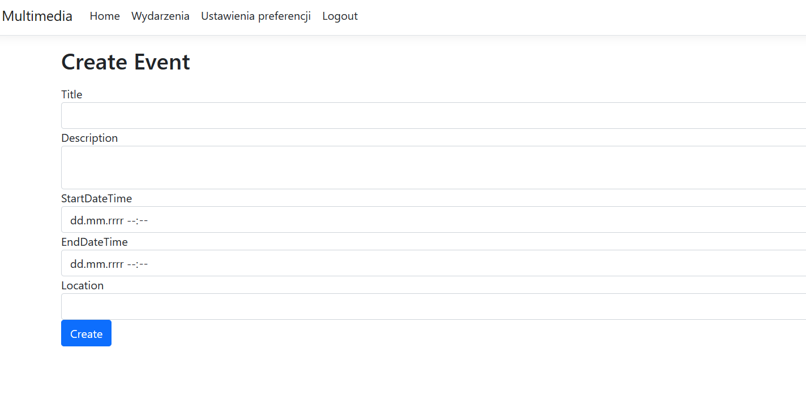
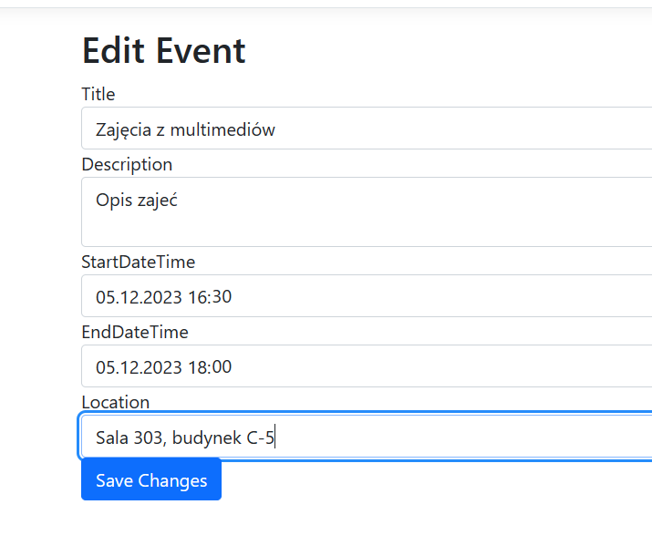
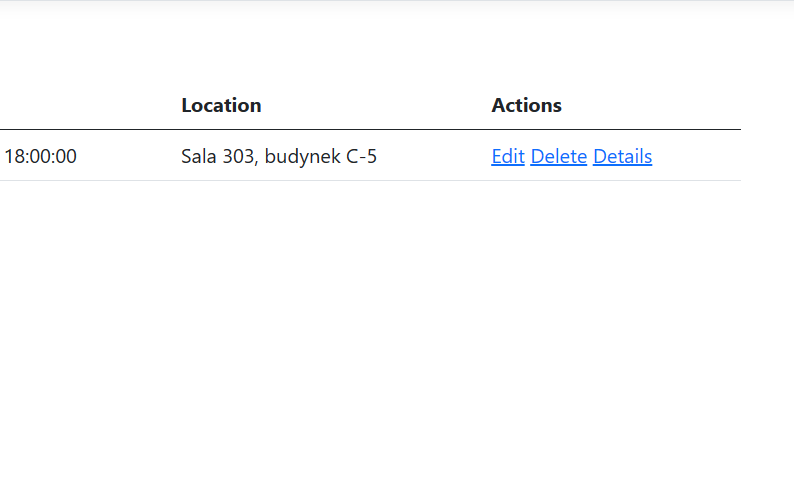
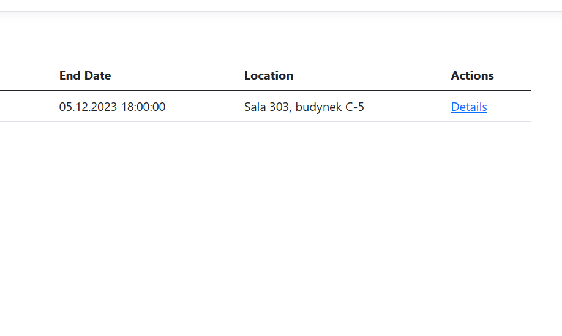
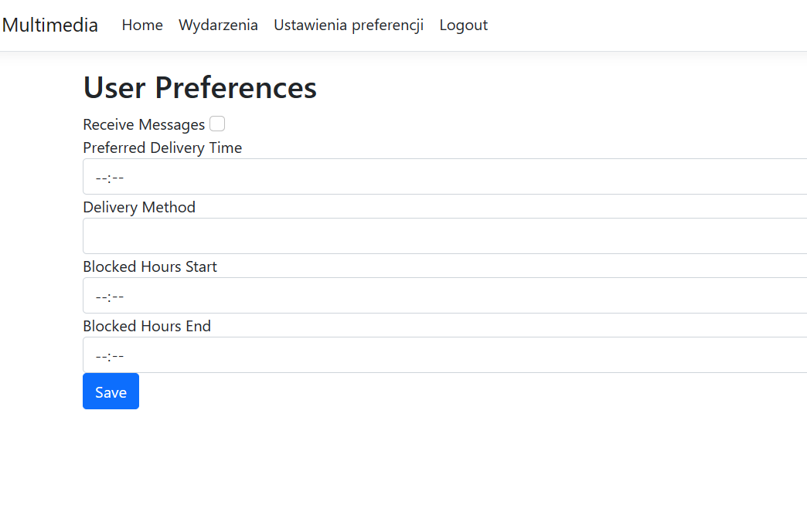
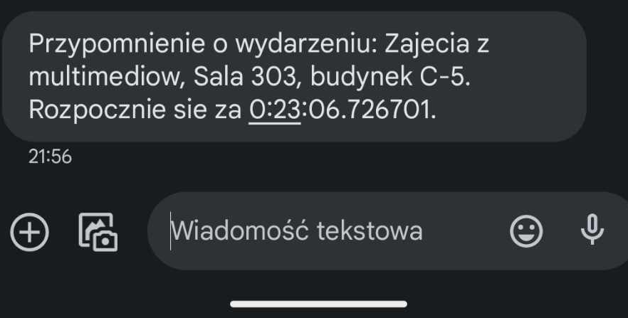

# Aplikacja Multimedia - Opis Funkcjonalności

## Połączenie z Bazą Danych
Aplikacja wykorzystuje `SchoolEventsContext`, dziedziczącą z `DbContext`, do zarządzania danymi w bazie. Umożliwia to wykonywanie operacji CRUD (Create, Read, Update, Delete) na różnych modelach danych, w tym użytkownikach, zdarzeniach i preferencjach użytkownika.

## Logowanie i Rejestracja
- **Logowanie:** Użytkownik loguje się podając email i hasło. Metoda `Login` w `AccountController` weryfikuje te dane w bazie danych i, w przypadku sukcesu, uwierzytelnia użytkownika za pomocą mechanizmu cookie.



- **Rejestracja:** Metoda `Register` umożliwia tworzenie nowych kont użytkowników. Sprawdza, czy użytkownik już istnieje w bazie lub w systemie LDAP, a następnie rejestruje nowego użytkownika z odpowiednią rolą.



## Uwierzytelnianie LDAP
Uwierzytelnianie LDAP jest używane w procesie rejestracji do weryfikacji użytkowników i przypisania im odpowiednich ról (np. admin, użytkownik).



## Zarządzanie Zdarzeniami
- **Dodawanie Zdarzeń:** Admini mogą tworzyć nowe zdarzenia poprzez formularz w `EventsController`.


- **Edycja Zdarzeń:** Istniejące zdarzenia mogą być edytowane, co obejmuje zmianę ich szczegółów takich jak tytuł, opis, data i miejsce.


- **Usuwanie Zdarzeń:** Zdarzenia mogą być usuwane, przy czym aplikacja obsługuje usuwanie z uwzględnieniem konkurencyjnego dostępu do bazy danych.


Zarządzanie tymi zdarzeniami dostępne jest tylko dla użytkownika z przypisaną rola admin, dla użytkowników ustawienia te są niedostepne


## Preferencje Użytkownika
- **Wyświetlanie Preferencji:** Użytkownicy mogą przeglądać swoje ustawienia preferencji w `PreferencesController`.
- **Zapisywanie Preferencji:** Użytkownicy mogą aktualizować swoje preferencje, które są następnie zapisywane w bazie danych. Jeżeli użytkownik miał już ustawione preferencje są one ustawiane w formularzu przy wejściu do edycji preferencji. Formularz pusty przez brak ustawionych prefernecji w bazie


# Konfiguracja Środowiska z Dockerem

Aplikacja korzysta z bazy danych MsSQL Server oraz serwera LDAP, które są uruchamiane jako kontenery Docker. Poniżej znajduje się przewodnik konfiguracji tych usług, wraz z narzędziem PHP LDAP Admin do zarządzania LDAP.

## Konfiguracja Bazy Danych SQL Server
Baza danych działa na obrazie Docker `mcr.microsoft.com/mssql/server:latest`. Aby ją uruchomić, wykonaj poniższe kroki:

1. **Pobranie Obrazu SQL Server:**
   ```bash
   docker pull mcr.microsoft.com/mssql/server:latest
```
2. **Uruchomienie Kontenera SQL Server:**
Użyj poniższego polecenia, aby uruchomić kontener SQL Server, przekierowując port 1434 na hoście do portu 1433 w kontenerze.
```bash
   docker run -e 'ACCEPT_EULA=Y' -e 'SA_PASSWORD=YourStrong!Passw0rd' -p 1434:1433 --name sql_server -d mcr.microsoft.com/mssql/server:latest
```
3. **Konfiguracja Serwera LDAP
Serwer LDAP jest uruchamiany na obrazie osixia/openldap:1.5.0. Postępuj zgodnie z poniższymi krokami, aby go skonfigurować:**
Pobranie Obrazu OpenLDAP:
```bash
   docker pull osixia/openldap:1.5.0
```
Uruchomienie Kontenera LDAP:
Uruchom kontener LDAP, używając poniższego polecenia:
```bash
   docker run --name ldap_server -p 389:389 -p 636:636 --detach osixia/openldap:1.5.0
```
4. **Konfiguracja PHP LDAP Admin**
Do zarządzania serwerem LDAP wykorzystywane jest narzędzie PHP LDAP Admin, działające na obrazie osixia/phpldapadmin:latest.
Pobranie Obrazu PHP LDAP Admin:
```bash
   docker pull osixia/phpldapadmin:latest
```
Uruchomienie Kontenera PHP LDAP Admin:
Uruchom PHP LDAP Admin, używając poniższego polecenia. Narzędzie będzie dostępne przez przeglądarkę.
```bash
   docker run --name phpldapadmin -p 6443:443 --hostname phpldapadmin-server --link ldap_server:ldap-host --env PHPLDAPADMIN_LDAP_HOSTS=ldap-host -d osixia/phpldapadmin:latest
```
Po uruchomieniu, PHP LDAP Admin będzie dostępny pod adresem https://localhost:6443.


### Dodawanie Grup i Użytkowników w LDAP za pomocą Pliku LDIF

#### Dodawanie Grupy

Plik LDIF (LDAP Data Interchange Format) umożliwia dodawanie grup i użytkowników do katalogu LDAP. Poniżej znajdziesz przykłady sekcji LDIF dla dodawania grupy.

```ldif
# Grupa Aplikacyjna
dn: cn=AppGroup,ou=Groups,dc=example,dc=com
objectClass: top
objectClass: groupOfNames
cn: AppGroup
description: Grupa Aplikacyjna
member: uid=user1,ou=Users,dc=example,dc=com
member: uid=user2,ou=Users,dc=example,dc=com
```
W powyższym przykładzie:

- dn określa unikalną ścieżkę grupy.
- objectClass definiuje typ obiektu, w tym przypadku top i groupOfNames.
- cn to Common Name, czyli nazwa grupy.
- description to opcjonalny opis grupy.
- member zawiera listę użytkowników, którzy należą do grupy.


```ldif
# Użytkownik 1
dn: uid=user1,ou=Users,dc=example,dc=com
objectClass: top
objectClass: person
objectClass: organizationalPerson
objectClass: inetOrgPerson
uid: user1
cn: User One
sn: One
givenName: User
mail: user1@example.com
userPassword: {SHA}hashed_password

# Użytkownik 2
dn: uid=user2,ou=Users,dc=example,dc=com
objectClass: top
objectClass: person
objectClass: organizationalPerson
objectClass: inetOrgPerson
uid: user2
cn: User Two
sn: Two
givenName: User
mail: user2@example.com
userPassword: {SHA}hashed_password
```

W powyższym przykładzie:
- Dla każdego użytkownika zdefiniowano unikalny identyfikator (uid).
- Użyto różnych typów obiektów (objectClass), takich jak top, person, organizationalPerson, inetOrgPerson.
- cn, sn, givenName to różne atrybuty dotyczące nazwiska i imienia.
- mail to adres e-mail użytkownika.
- userPassword to zahaszowane hasło użytkownika (w przykładzie użyto algorytmu SHA).

Po skonfigurowaniu powyższych kontenerów, aplikacja powinna być w stanie połączyć się z bazą danych SQL Server oraz serwerem LDAP poprzez odpowiednie adresy sieciowe i porty, a także zarządzać LDAP za pomocą PHP LDAP Admin.


# School Events Database Setup

```sql
CREATE DATABASE SchoolEventsDB;

DROP TABLE Events;
DROP TABLE Roles;
DROP TABLE Users;

USE SchoolEventsDB;

-- Tworzenie tabeli 'Events'
CREATE TABLE Events (
    EventID INT PRIMARY KEY IDENTITY(1,1), -- Auto-increment dla EventID
    Title NVARCHAR(255),
    Descrip NVARCHAR(255),
    StartDateTime DATETIME,
    EndDateTime DATETIME,
    Location NVARCHAR(255), -- Może zawierać budynek i salę
    Description NVARCHAR(MAX) -- Dodatkowe informacje o wydarzeniu
);

-- Tworzenie tabeli 'Roles'
CREATE TABLE Roles (
    RoleID INT PRIMARY KEY IDENTITY(1,1), -- Auto-increment dla RoleID
    RoleName NVARCHAR(255)
);

-- Tworzenie tabeli 'Users'
CREATE TABLE Users (
    UserID INT PRIMARY KEY IDENTITY(1,1), -- Auto-increment dla UserID
    Username NVARCHAR(255),
    PasswordHash NVARCHAR(255), -- Hash hasła użytkownika
    Email NVARCHAR(255),
    PhoneNumber NVARCHAR(255),
    FirstName NVARCHAR(255),
    LastName NVARCHAR(255),
    RoleID INT, -- Klucz obcy odnoszący się do tabeli 'Roles'
    FOREIGN KEY (RoleID) REFERENCES Roles(RoleID) -- Definicja klucza obcego
);

CREATE TABLE UserPreferences (
    UserID INT PRIMARY KEY,
    ReceiveMessages BIT, -- 1 or 0 to indicate whether the user wants to receive messages
    PreferredDeliveryTime TIME, -- Preferred time for message delivery
    DeliveryMethod VARCHAR(50), -- Method of delivery (e.g., email, SMS, app notification)
    BlockedHoursStart TIME, -- Start time of the blocked hours
    BlockedHoursEnd TIME -- End time of the blocked hours
);


CREATE TABLE SentMessagesHistory (
    MessageID INT IDENTITY(1,1) PRIMARY KEY,
    UserID INT,
    EventID INT,
    PhoneNumber NVARCHAR(20),
    MessageText NVARCHAR(MAX),
    SentDateTime DATETIME,
    FOREIGN KEY (UserID) REFERENCES Users(UserID),
    FOREIGN KEY (EventID) REFERENCES Events(EventID)
);

-- Tabela zajęć
CREATE TABLE Zajecia (
    EventID INT PRIMARY KEY IDENTITY(1,1),
    Data DATE NOT NULL,
    GodzinaRozpoczecia TIME NOT NULL,
    GodzinaZakonczenia TIME NOT NULL,
    Budynek VARCHAR(50) NOT NULL,
    Sala VARCHAR(20) NOT NULL,
    Opis VARCHAR(255),
    Prowadzacy VARCHAR(100) NOT NULL
);

-- Tabela przypisań grupowych
CREATE TABLE GroupAssignments (
    UserID INT,
    EventID INT,
    FOREIGN KEY (UserID) REFERENCES Users(UserID),
    FOREIGN KEY (EventID) REFERENCES Zajecia(EventID)
);

ALTER TABLE SentMessagesHistory
DROP CONSTRAINT FK__SentMessa__Event__55BFB948;

ALTER TABLE SentMessagesHistory
ADD CONSTRAINT FK_SentMessagesHistory_Events
FOREIGN KEY (EventID) REFERENCES Events(EventID) ON DELETE CASCADE;

```

This SQL script sets up the necessary infrastructure for the School Events database. The database includes tables for events, user roles, users, user preferences, sent messages history, classes, and group assignments.

## Table Descriptions

1. **Events:** Contains information about events, including title, description, start and end date/time, location, and additional details.

2. **Roles:** Defines user roles within the system.

3. **Users:** Stores user details, including username, hashed password, email, phone number, first and last name, and the user's role.

4. **UserPreferences:** Holds user preferences, including whether the user wants to receive messages, preferred delivery time, delivery method, and blocked hours.

5. **SentMessagesHistory:** Records sent messages, including user and event IDs, phone number, message text, and the sent date/time. The foreign keys reference the 'Users' and 'Events' tables.

6. **Zajecia:** Represents classes, storing information such as date, start and end times, building, room, description, and instructor.

7. **GroupAssignments:** Links users to specific classes through user and event IDs.

## Instructions

1. Execute this script in a MSSQL Server environment to create the 'SchoolEventsDB' database and tables.

2. Ensure that you have the necessary permissions to execute the queries.

3. Review and customize the script as needed for your application.

4. Adapt the foreign key relationships and constraints based on your specific requirements.

Feel free to modify the script to fit your database structure and application needs.

## Ustawienie pliku appsetings.json
Dla poprawnego działania aplikacji trzeba ustawić odpowiednie połączenia w pliku appsetings.json w aplikacji MVC

```json
  "ConnectionStrings": {
    "SchoolEventsDB": "Server=localhost,1434;Database=SchoolEventsDB;User Id=sa;Password=yourStrongPassword123;TrustServerCertificate=True;"
  },

  "Ldap": {
    "Url": "localhost",
    "Port": 389,
    "SearchBase": "dc=mydomain,dc=com",
    "SearchFilter": "",
    "AdDomain": "mydomain.com",
    "ServiceAccountUsername": "cn=admin,dc=mydomain,dc=com",
    "ServiceAccountPassword": "admin"
  }

Dane do połączenia z LDAP oraz z bazą danych trzeba dostosować do swoich połączeń
```


## Prerequisites for SMS script

Before using this script, ensure the following:

1. **Android Device**: Connect your Android device to the computer using a USB cable and enable USB debugging mode in Developer Options.

2. **Database Configuration**: Update the database connection settings in the script to match your SQL Server environment.

3. **Python Dependencies**: Install the required Python packages using the following command:
   ```bash
   pip install pyodbc unidecode
```

#Configuration - Dostosować ustawienia do połączenia z bazą danych
# Database Connection Settings
server = 'localhost,1434'
database = 'SchoolEventsDB'
username = 'sa'
password = 'yourStrongPassword123' 
trust_server_certificate = 'yes'  # albo 'no' w zależności od preferencji

## Run the script using Python:
python sms3.py
The script will check user preferences and send SMS reminders for upcoming events accordingly

Wiadomość zostane dostarczona na numer telefonu wszystkich użytkowników z bazy danych dla których ustawiony przez nich czas jest mniejszy niż czas do wydarzenia


#Troubleshooting Tips
## Troubleshooting Tips
- If your device is not recognized, try restarting both the computer and the Android device.
- Make sure that ADB recognizes your device by running the command `adb devices` in the terminal.
- If USB debugging is not enabled, enable it in the Developer Options on your Android device.
- Ensure that you have the necessary USB drivers installed for your Android device.